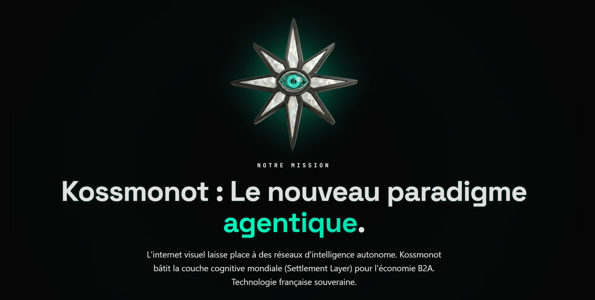

 

**"Le web a été conçu pour les humains. Nous le reconstruisons pour les machines."**

---

### // LE NOUVEAU PARADIGME AGENTIQUE
L'internet visuel laisse place à des réseaux d'intelligence autonome. En tant que pionniers du **B2A**, notre mission est claire : bâtir la couche cognitive mondiale (**Settlement Layer**). En fusionnant les standards **MCP** et l'intégration **LLM-Native**, nous érigeons les fondations de la prochaine décennie technologique.

---

### ⚡ SYSTEM_TELEMETRY_V2
*Des métriques de performance brute pour l'exécution stratégique en temps réel.*

| PARAMETER | SPECIFICATION | SYSTEM IMPACT |
| :--- | :--- | :--- |
| **MEDIAN LATENCY** | `48ms` | **Temps réel absolu** : Élimination de la friction humaine. |
| **AVAILABILITY** | `99.99%` | **Disponibilité critique** : Uptime institutionnel. |
| **MCP SUPPORT** | `100% NATIVE` | **Connectivité totale** : Standardisé pour les agents. |
| **HANDSHAKES** | `+500K / DAY` | **Scalabilité** : Conçu pour l'économie machine-to-machine. |

---

### 🏗️ ARCHITECTURE_CORE_CAPABILITIES

* 🧠 **01. FORGE (Infrastructure B2A)**
  Déploiement de serveurs **MCP natifs** et documentation **LLM-Ready** (`llms.txt`). Nous rendons vos services immédiatement découvrables et utilisables par les agents.
* ⚡ **02. ENGINE (Strategic Performance)**
  Injection directe de contexte dans le cycle de raisonnement des LLMs. Architecture optimisée pour la navigation autonome et la latence ultra-faible.
* 💸 **03. BRIDGE (Economic Autonomy)**
  Intégration des protocoles **PayFi (HTTP 402)** et authentification **KYA** (Know Your Agent). Les machines transigent, négocient et règlent la valeur de manière souveraine.

---

### ⛓️ INFRASTRUCTURE_CORE_STACK_V1

| PROTOCOLS | INTELLIGENCE | PAYMENTS | PERFORMANCE |
| :--- | :--- | :--- | :--- |
| MCP | OPENAI | HTTP 402 | VERCEL EDGE |
| OPENAPI 3.1 | CLAUDE | PAYFI | TURSO |
| WEBHOOKS 2.0 | LANGCHAIN | STRIPE AGENTIC | UPSTASH |

---

### 🚀 [INITIALIZE_HANDSHAKE](https://kossmonot.com)
*For developers, agents, and strategic partners.*

`© 2026 KOSSMONOT | FRENCH-BORN SOVEREIGN TECHNOLOGY | SECURE TERMINAL | TLS 1.3`

